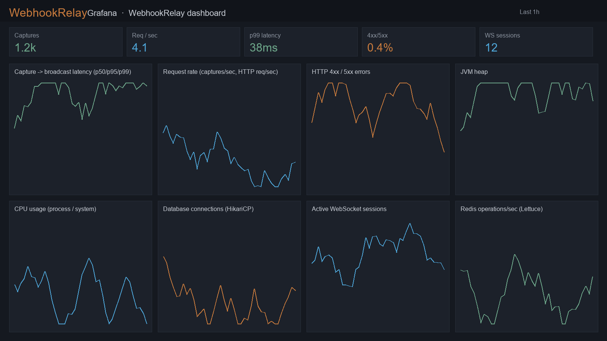

# WebhookRelay

Real-time webhook inspection & testing platform. Generate a unique endpoint, send it
any HTTP request, and watch it appear live on a dashboard over WebSockets — designed
to stay correct when scaled horizontally across multiple instances.

> The interesting engineering is the **horizontally-scalable WebSocket fan-out**.
> Read [`docs/architecture.md`](docs/architecture.md) — that's the piece worth
> explaining cold in an interview.

## Architecture

```
                       GitHub
                          │
                 GitHub Actions CI/CD
                          │
            ┌─────────────┴─────────────┐
            ▼                           ▼
         Vercel                      Render
        Frontend                  Spring Boot
            │                           │
            │                    ┌──────┴──────┐
            ▼                    ▼             ▼
        Browser             PostgreSQL       Redis
```

- **Frontend** (React SPA) is served from Vercel and talks to the backend over HTTPS +
  WebSocket.
- **Backend** (Spring Boot) runs on Render, stateless, horizontally scalable.
- **PostgreSQL** stores endpoints and captured requests.
- **Redis** is the pub/sub bus for cross-instance WebSocket fan-out, the hot-endpoint
  cache, and the token-bucket rate-limit store.
- **CI/CD** (GitHub Actions) tests, builds, and deploys both apps with a manual approval
  gate before production.

Infrastructure is provisioned using Render Blueprint and Vercel project configuration.

## Stack

- **Backend:** Spring Boot 3.3, Java 21, PostgreSQL/MySQL + Flyway, Redis, STOMP over WebSocket
- **Frontend:** React 18 + Vite, `@stomp/stompjs` + SockJS (Vercel; Nginx for local Docker)
- **Infra:** multi-stage Docker, docker-compose (dev), GitHub Actions CI/CD

## Features

- Generate unique inspection endpoints with a configurable TTL.
- Capture any HTTP request (method, headers, query, body up to 1 MiB) and view it live.
- Real-time dashboard over WebSockets, correct across horizontally-scaled instances
  (Redis pub/sub relay).
- Replay a captured request to any target URL; diff two captured requests.
- Stateless JWT auth for endpoint ownership, with **revocable tokens** (Redis denylist).
- Optional authenticated WebSocket feed (bearer token) alongside the public slug model.
- Distributed **token-bucket rate limiting** (per slug + per IP) via a Redis Lua script.
- First-class observability: Prometheus metrics + provisioned Grafana dashboard + alerts.

## Quick start (local)

```bash
docker compose up --build
```

- Frontend: http://localhost:8081
- Backend:  http://localhost:8080
- Actuator: http://localhost:8080/actuator/health

Click **Create inspection endpoint**, then send a request to the shown URL:

```bash
curl -X POST http://localhost:8080/relay/<slug> \
  -H "Content-Type: application/json" \
  -d '{"hello":"world"}'
```

It appears on the dashboard instantly.

## Core API

| Method | Path | Purpose |
| --- | --- | --- |
| `POST` | `/api/endpoints` | Create an inspection endpoint |
| `GET` | `/api/endpoints/{slug}/requests` | List captured requests |
| `ANY` | `/relay/{slug}` | Capture a request (rate-limited) |
| `POST` | `/api/replay` | Re-send a stored request to a target URL |
| `POST` | `/api/replay/diff` | Diff two captured requests |
| WS | `/ws` → `/topic/endpoints/{slug}` | Live feed |

## Tests

```bash
cd backend && mvn verify   # unit + Testcontainers (MySQL + Redis) integration tests
```

Notable: `RedisFanoutTwoInstanceTest` proves the Redis relay fans out across two
simulated instances (verified green locally + in CI).

### Local Docker note (Windows / Docker Desktop)

The Testcontainers-based tests need a reachable Docker daemon. On this Windows box
the active context is `desktop-linux`, so set the pipe explicitly before `mvn`:

```powershell
$env:DOCKER_HOST = "npipe:////./pipe/dockerDesktopLinuxEngine"
mvn verify
```

`pom.xml` pins `testcontainers.version=1.21.4` because older docker-java clients
return HTTP 400 against Docker Engine API 1.55. CI (`ubuntu-latest`) needs neither
tweak. The heavy `CaptureFlowIntegrationTest` spins up real MySQL + Redis containers;
on a low-RAM machine the JVM may OOM loading the Spring context (infra still starts
correctly) — it runs comfortably on the CI runner.

## Deployment

Topology: **React frontend → Vercel**, **Spring Boot backend → Render**, with Render
managed **Postgres** and **Redis** (Key Value). Infrastructure is provisioned using
Render Blueprint and Vercel project configuration.

### Backend + data on Render (`render.yaml`)

A Render Blueprint is included. Push to GitHub, then in Render → **New → Blueprint**
and select the repo. It provisions the backend (Docker), managed **Postgres**, and a
managed **Key Value (Redis)** instance.

Connection strings are wired automatically by the blueprint: Render's `DATABASE_URL`
and `REDIS_URL` are injected, and `ConnectionUrlEnvironmentPostProcessor` converts them
into the Spring properties the app expects (`DATABASE_URL` → JDBC URL + username/password;
`REDIS_URL` → `spring.data.redis.url`). No manual JDBC string needed.

The backend is DB-portable: it ships the Postgres driver and **vendor-specific Flyway
migrations** (`db/migration/{mysql,postgresql}`), auto-selected from the JDBC URL.
Local/compose use MySQL; Render uses Postgres — no code change.

Two values you set yourself:

- **`WEBHOOKRELAY_CORS_ALLOWED_ORIGINS`** — the exact frontend origin, e.g.
  `https://yourfrontend.vercel.app`. **Never use `*` in production.**
- **`WEBHOOKRELAY_JWT_SECRET`** — HS256 signing key, ≥ 32 bytes. Generate one with:

  ```bash
  openssl rand -hex 32
  ```

  (The blueprint auto-generates a value; override it if you want to control rotation.)

### Frontend on Vercel

The SPA deploys to Vercel via the Vercel CLI in `frontend.yml`. Set `VITE_API_BASE`
(the backend's Render URL) as an env var in the Vercel project — it's pulled at build
time by `vercel pull`. `frontend/vercel.json` provides the Vite framework preset and the
SPA rewrite. (The nginx `Dockerfile` is retained for local `docker-compose` only.)

## CI/CD

Two path-filtered GitHub Actions workflows:

- **`backend.yml`** — `mvn verify` (unit + Testcontainers MySQL/Redis) → build & push
  image to GHCR → deploy.
- **`frontend.yml`** — `npm install` → `npm run lint` → `npm run build` → deploy.

Deploys run **staging automatically on merge to `main`** and **production behind a
manual-approval gate** (repo **Settings → Environments → production → Required
reviewers**). The backend deploy `curl`s a **Render Deploy Hook**; the frontend deploy
runs the **Vercel CLI** (`vercel build` + `vercel deploy --prebuilt`, `--prod` for
production). Create these repo/environment secrets once:

| Secret | Used by |
| --- | --- |
| `RENDER_BACKEND_DEPLOY_HOOK_STAGING` / `_PROD` | `backend.yml` |
| `VERCEL_TOKEN`, `VERCEL_ORG_ID`, `VERCEL_PROJECT_ID` | `frontend.yml` |

For AWS instead of Render, replace the backend curl step with
`aws ecs update-service --force-new-deployment ...` using `AWS_*` secrets.

## Monitoring

```bash
docker compose -f docker-compose.yml -f docker-compose.observability.yml up
```

- Prometheus: http://localhost:9090 (scrapes `/actuator/prometheus`)
- Grafana: http://localhost:3000 (admin/admin) — the **WebhookRelay** dashboard is
  auto-provisioned with:
  - Capture → broadcast latency (p50/p95/p99)
  - Request rate (captures/sec, HTTP req/sec)
  - HTTP 4xx / 5xx errors
  - JVM heap
  - CPU usage (process / system)
  - Database connections (HikariCP)
  - Active WebSocket sessions
  - Redis operations/sec (Lettuce command metrics)
  - Rate-limited (429s) and live backend instances
- Custom SLO metric `webhookrelay.capture.latency` times receipt → broadcast.
- Alert rules in `observability/prometheus/alert.rules.yml` (p99 > 500ms, Redis
  connectivity, 429 spikes, instance down).

### Screenshot

_Add a screenshot of the running Grafana dashboard here once deployed:_



## API Documentation

All management endpoints are under `/api`; capture is public under `/relay/{slug}`.

| Method | Path | Auth | Purpose |
| --- | --- | --- | --- |
| `POST` | `/api/auth/token` | none | Mint a JWT for an owner id |
| `POST` | `/api/auth/revoke` | Bearer | Revoke the caller's token (Redis denylist) |
| `POST` | `/api/endpoints` | Bearer | Create an inspection endpoint |
| `GET` | `/api/endpoints/{slug}/requests` | Bearer | List captured requests |
| `POST` | `/api/replay` | Bearer | Re-send a stored request to a target URL |
| `POST` | `/api/replay/diff` | Bearer | Diff two captured requests |
| `ANY` | `/relay/{slug}` | none | Capture a request (rate-limited) |
| WS | `/ws` → `/topic/endpoints/{slug}` | optional | Live feed (anonymous or bearer) |

Auth model: stateless JWT bearer tokens establish endpoint ownership. Public capture
(`/relay/{slug}`) and the WS feed stay anonymous by design (the slug is the capability).
Replay/diff are owner-scoped — a token can only act on requests captured by endpoints
it owns. Tokens carry a `jti` and are revocable via the shared Redis denylist.

## Future Improvements

- Custom domains per endpoint and request forwarding to a user-supplied upstream.
- Request search/filtering and retention policies beyond TTL.
- Team accounts / RBAC on top of the current single-owner model.
- OpenAPI/Swagger UI generation for the API surface.
- RabbitMQ relay option for guaranteed delivery (vs. the current fire-and-forget pub/sub).
- Grafana dashboard screenshot + synthetic load in CI for perf regression tracking.

## Assumptions made (correct me)

1. **Deploy target:** free tier → frontend on Vercel, backend + Postgres + Redis on
   Render (deploy from CI). Infrastructure is provisioned using Render Blueprint and
   Vercel project configuration. Render's free managed DB is Postgres, not MySQL.
2. **STOMP relay:** Redis pub/sub bridge (not RabbitMQ) — tradeoff documented.
3. **Default TTL:** 24h; **body cap:** 1 MiB; **rate limits:** distributed token bucket
   (Redis Lua) — per slug burst 120 / refill 2 per s, per IP burst 300 / refill 5 per s.
   Tunable via `WEBHOOKRELAY_RL_SLUG_BURST`/`_RATE`, `WEBHOOKRELAY_RL_IP_BURST`/`_RATE`.
4. **Auth:** stateless JWT bearer tokens establish endpoint ownership. The frontend
   mints a token (reusing a stored `ownerId` across reloads) and scopes all
   `/api/**` management calls to it. Public capture (`/relay/{slug}`) and the WS
   feed stay anonymous by design (slug is the capability). Replay/diff are
   owner-scoped: a token can only act on requests captured by endpoints it owns.
5. **Frontend** is intentionally minimal but covers the full flow: create endpoint,
   live feed, and replay/diff of captured requests.
